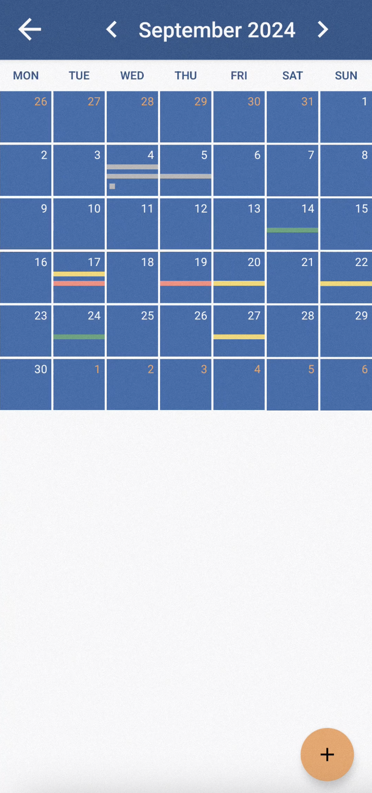
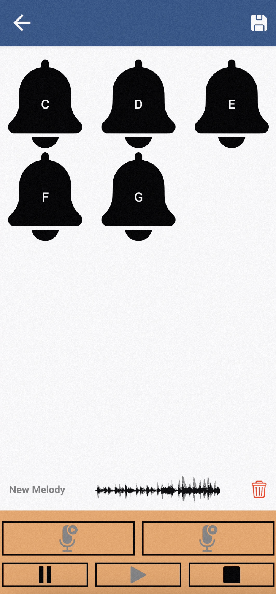

# BellApp

### About This Project

This project was developed as part of the "Programmazione Mobile" course at the University of Genoa. It was further expanded and refined as part of the final thesis for the Bachelor's degree in "Ingegneria Informatica". The thesis aimed to explore mobile app development and Firebase integration to create a modern and efficient bell event management system.

Here you have the abstract of our thesis:

> The idea for this thesis stems from the observation of the bell-ringing sector, which is not fully aligned with modern technologies. 
Through an analysis of both the Italian and international markets, and with the collaboration of a leading company in the field, we identified a need for innovation to improve the management of bell systems.
Our project offers an advanced and modern alternative for scheduling and automatically executing events and melodies. Through an Android application and a hardware circuit connected to a centralized database, the system provides intuitive and flexible control of the bell systems. The circuit, built with an STM32 Nucleo board and an ESP32 module, uses buzzers to simulate the sound of bells. Users can schedule events through a calendar and create custom melodies, which the system will play at the specified time and date.
This project offers a concrete solution to the modernization needs of the sector, projecting it into the future while maintaining respect for and preserving the bell-ringing tradition.

## Table of Contents
- [Features](#features)
- [Technologies](#technologies)
- [Installation](#installation)
- [Usage](#usage)
- [Screenshots](#screenshots)

## Features
- 🔔 **Systems Management**: Manage more systems with a single account.
- 📅 **Event Management**: Add, edit, and delete events.
- 🎶 **Create Melodies**: Create your melodies and reproduce them in your system.
- 🔊 **Real Time Notification**: Receive notification while an event is reproducing. �
- 🌐 **Firebase Integration**: Sync events in real-time using Firestore and store your picture in the Storage.

## Technologies
- **Kotlin**: The main programming language for the application.
- **Firebase Firestore**: Used to store users and systems information.
- **Firebase Storage**: Used to store profile pictures and melody files.
- **Firebase Cloud Messaging**: Used to send and receive real-time notifications.
- **Firebase Authentication**: It manages the authentication for the application.

## Installation

1. Clone this repository:
    ```bash
    git clone https://github.com/FN-Org/BellApp.git
    ```

2. Open the project in [Android Studio](https://developer.android.com/studio).

3. Make sure you have Firebase configured for your project:
    - Go to the [Firebase Console](https://console.firebase.google.com/).
    - Create a new project or use an existing one.
    - Add your app to Firebase and download the `google-services.json` file.
    - Place the `google-services.json` in the `app/` directory of the project.

4. Sync the project with Gradle to download all necessary dependencies.

5. Run the app and enjoy!

## Usage

### Add a New System
1. Navigate with the navigation drawer on the left to the **Add System Fragment**.
2. Enter the ID of the system you want to link.
3. Search for the system entered.
4. Insert the PIN to complete the operation.

### Create a New Event
1. Navigate to the **Month View Fragment** to view the calendar.
2. Tap on any day to create a new event.
3. Choose the event time, date, and color.
4. Press **Save** to store the event.

### Edit an Existing Event
1. Click on an existing event from the **Month View Fragment**.
2. Modify the event details (time, day, melody, color).
3. Press **Save** to update the event.

### Delete an Event
1. When viewing an event, press the **Delete** button to remove the event from the calendar.

### Create Melody
1. Navigate to the **Personal Melodies Fragment** to view your melodies.
2. Tap on the orange floating button.
3. Use the control panel to start registering your melody.
4. Tap on the bells icon to reproduce the note.
5. Stop the registration.
6. Click the save button and insert the melody title.

## Screenshots
### Welcome & Login Activities
| Fragment 1 | Fragment 2 | Fragment 3 | Authentication |
|----------------|-----------------|---------------|----------------|
|  |  |  |  |

### Main Activity
| Home Page | Add System | Settings |
|----------------|-----------------|---------------|
|  |  |  |

### Calendar & Melody Activities
| Month View | Add Event | Personal Melodies | Create Melody |
|----------------|-----------------|-----------------|---------------|
|  |  |  |  |

